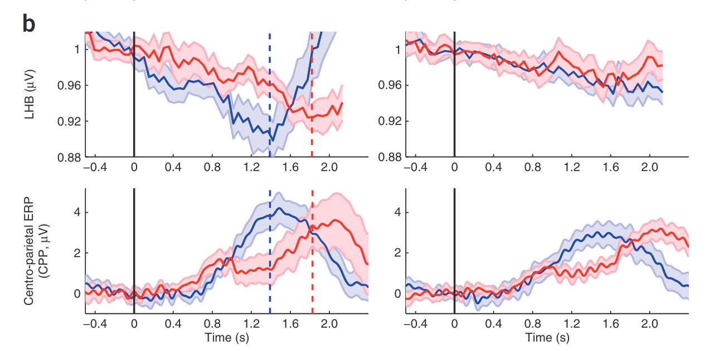

# Rationale of sample size planning

We planned our sample size based on the most critical hypothesis. In the current study, the most important hypothesis is that CPP is an indicator of evidence accumulaiton and LHB is not.

This critical hypothesis can only be tested by coombing the results from task 1 and task 2/3. In task 1, both CPP and LHB will show that cumulative SSVEP explain more variance than the non-cumulative SSVEP. In task 2/3, CPP still show a pattern of evidence accumulation, while LHB does not. However, due the lack of quantitative results of task 2/3 in the original paper, we will extract data from the figures using XXX software.

Please check the possible tools:

-   [automeris](https://automeris.io/WebPlotDigitizer/)

-   [automeris.app](https://apps.automeris.io/wpd/)

-   [Pick et al (2019): metaDigitise](https://cran.r-project.org/web/packages/metaDigitise/vignettes/metaDigitise.html)

Here is the original figure of task 3 (mental counting task):

<!-- # insert picture "orig_fig3b.jpg" here -->



Here is the original figure of task 2 (attention task):

<!-- # insert picture "orig_fig4d.jpg" here -->


# Import packages

```{r import neccessary packages}
rm(list=ls())
# load package
# if 'pacman' is not exist, this package can be installed
if (!require("pacman")) {
  install.packages("pacman")
}
# the package 'pacman' can use 'p_load' to load existed package or install package
library(pacman)
pacman::p_load(
  "tidyverse", # this package used to preprocess the raw data
  "here", # this package can set the working directory as the root directory the script exist
  "papaja", # this package can create the manuscripts to APA.
  "effectsize",
  "pwr",
  "BUCSS",
  "cowplot"
)
# set directory
pack_info <- sessionInfo() # store the information of packages
here::set_here()
print(getwd()) # print the path
set.seed(123)
```

# Experiment 1

## effect size

```{r effect size of exp1}
# original paper:  t-test results: t(18)=3.4,P=0.003
(result1_LHB <- effectsize::t_to_d(
  t = c(3.4),
  df = 18,
  paired = TRUE
))
# original paper: t(18)=4.0,P=0.0009
(result1_CPP <- effectsize::t_to_d(
  t = c(4.0),
  df = 18,
  paired = TRUE
))

# use the lower CI of effect size
LHB_lowereff <- result1_LHB[1, 3]
CPP_lowereff <- result1_CPP[1, 3]
```

## power analysis

### Using the lower CI of effect size (conservative)

```{r}
find_value <- function(dir = "min", ...) {
  values <- c(...) # 将输入参数转为向量
  if (dir == "min") {
    return(min(values)) # 返回最小值
  } else if (dir == "max") {
    return(max(values)) # 返回最大值
  } else {
    stop("only 'min' or 'max'") # 如果dir参数不为'min'或'max'，则报错
  }
}


pwr_result1 <- pwr::pwr.t.test(
  d = find_value(
    dir = "min", LHB_lowereff,
    CPP_lowereff
  ), # get the smaller effect size between two value
  sig.level = 0.05,
  power = 0.80,
  type = "pair"
)
(sample_size1 <- pwr_result1[["n"]]) # get the sample size of experimental 1
```

### Using the BUCSS (correct bias and uncertainty)

```{r}
LHB_adjust_ss <- ss.power.dt(3.4, 19,
  alpha.prior = 0.05, alpha.planned = 0.05,
  assurance = 0.8, power = 0.8
)[[1]]

CPP_adjust_ss <- ss.power.dt(4.0, 19,
  alpha.prior = 0.05, alpha.planned = 0.05,
  assurance = 0.8, power = 0.8
)[[1]]
find_value("max", LHB_adjust_ss, CPP_adjust_ss)
```

### using beta distribution and lower CI to simulate

```{r}
target_function <- function(params) {
  sim_n <- 1000000 # 1 million data
  alpha <- params[1]
  beta <- params[2]

  # simulate data
  diff <- rbeta(sim_n, shape1 = alpha, shape2 = beta) # diff of two sample


  # t 检验
  t_test <- t.test(diff, mu = 0) # t test

  # (Cohen's d)
  d <- effectsize::t_to_d(t = as.numeric(t_test$statistic), 
                          df_error = sim_n - 1, paired = TRUE)$d
  d <- as.numeric(d)

  # target value
  target_d <- find_value(dir = "min", LHB_lowereff, CPP_lowereff)

  # get the difference square
  return((d - target_d)^2)
}

# optimize the parameters
initial_params <- c(1, 1) # inite the parameter

# 设置优化算法的严格性
result <- optim(
  initial_params,
  target_function,
  method = "L-BFGS-B",
  lower = c(0.01, 0.01), # Beta shape can only be positive
  control = list(fnscale = 1, factr = 1e3, pgtol = 1e-10) # set some parameters
)
# 输出结果
cat("aplha after optimized:", result$par[1], "\n")
cat("beta after optimized:", result$par[2], "\n")
cat("Cohen's d of beta:", 
    sqrt(result$value) + find_value(dir = "min", 
                                    LHB_lowereff, CPP_lowereff), "\n")
cat("original effect: ", find_value(dir = "min", 
                                    LHB_lowereff, CPP_lowereff), "\n")
```
plot beta distribution by given parameters
```{r}
plot_sim_dat <- rbeta(100000, shape1 = result$par[1], shape2 = result$par[2])
hist(plot_sim_dat,
  breaks = 100,
  xlab = "the difference of R square"
)
```

### 把优化后的参数带入beta,对其进行可视化


```{r}
n_sims <- 1000 # Number of simulations
target_power <- 0.80 # Target power
effect_size <- find_value(dir = "min", 
                          LHB_lowereff, CPP_lowereff) # True effect size (mean difference)
type1_err <- 0.05
alpha <- result$par[1]
beta <- result$par[2]
initial_n <- 5
n <- 5 # Initial sample size
max_n <- 200
power_at_n <- numeric() # Store power for each sample size
cohens_ds_at_n <- numeric() # Store mean Cohen's d for each sample size

while (TRUE) {
  p_vals <- numeric(n_sims) # Preallocate p-value storage
  cohens_ds <- numeric(n_sims) # Preallocate Cohen's d storage

  for (sim in 1:n_sims) {
    difference <- rbeta(n, shape1 = alpha, shape2 = beta) # Simulate the difference scores
    t_test_result <- t.test(difference, mu = 0) # Run t-test
    p_vals[sim] <- t_test_result$p.value # Extract p-value
    d <- effectsize::t_to_d(
      t = t_test_result$statistic,
      df_error = n - 1, paired = TRUE
    )$d # Calculate Cohen's d
    cohens_ds[sim] <- as.numeric(d)
  }
  # Calculate power and mean Cohen's d for current sample size
  power_at_n <- c(power_at_n, mean(p_vals < type1_err))
  cohens_ds_at_n <- c(cohens_ds_at_n, mean(cohens_ds))

  # Check if the target power has been achieved
  if (power_at_n[length(power_at_n)] >= target_power || n >= max_n) {
    break
  }

  n <- n + 1 # Increase sample size
}

# Find the sample size where power reaches or exceeds 0.8
n_at_target_power <- which(power_at_n >= target_power)[1] + initial_n - 1
# Adjusting for initial sample size (n starts from 5)

plot(5:n, power_at_n, xlab = "Sample Size", ylab = "Power", main = "Power vs Sample Size")
abline(h = target_power, col = "red", lty = 2)
points(n_at_target_power, power_at_n[n_at_target_power - 4], col = "blue", pch = 19)
text(n_at_target_power - 5, power_at_n[n_at_target_power - 10], labels = paste("n =", n_at_target_power), pos = 4, col = "blue")

# Plot Cohen's d vs sample size
plot(5:n, cohens_ds_at_n, xlab = "Sample Size", ylab = "Mean Cohen's d", main = "Cohen's d vs Sample Size")
```


```{r}
here::i_am("script/1_Sample-size-plan.Rmd")
# 读取文件列表并将列名统一
file_data <- list.files(here::here("extract_data"), pattern = ".csv", full.names = TRUE) %>%
  purrr::map_df(~ {
    # 读取 CSV 文件
    data <- readr::read_csv(.x, show_col_types = FALSE)

    # 统一列名（假设第一列是问题所在，统一重命名为 "consistent_name"）
    colnames(data)[1] <- "x"
    colnames(data)[2] <- "y"

    path_name <- strsplit(.x, split = "/")[[1]][9]


    # 返回处理后的数据框，并增加文件来源列
    data %>%
      dplyr::mutate(source = stringr::str_sub(path_name, 1, -5)) %>%
      tidyr::separate(source, c("fig", "sub", "dv", "color"))
  })

fig3b_left <- file_data %>%
  dplyr::filter(fig == "fig3b" & sub == "left") %>%
  dplyr::arrange(x) %>% # 确保数据按 x 顺序排列
  ggplot(aes(x, y, color = color, group = color)) + # `group` 用于连接相同颜色的数据点
  geom_point() + # 绘制散点图
  geom_line() + # 绘制折线图
  facet_grid(factor(dv, levels = c("lhb", "cpp")) ~ .,
    scales = "free_y"
  ) +
  scale_color_manual(values = c("blue", "red"))

fig3b_right <- file_data %>%
  dplyr::filter(fig == "fig3b" & sub == "right") %>%
  dplyr::arrange(x) %>% # 确保数据按 x 顺序排列
  ggplot(aes(x, y, color = color, group = color)) + # `group` 用于连接相同颜色的数据点
  geom_point() + # 绘制散点图
  geom_line() + # 绘制折线图
  facet_grid(factor(dv, levels = c("lhb", "cpp")) ~ .,
    scales = "free_y"
  ) +
  scale_color_manual(values = c("blue", "red"))
rep_fig3b <- cowplot::plot_grid(fig3b_left + theme(legend.position = "none"), fig3b_right + theme(legend.position = "none"))

rep_fig4d <- file_data %>%
  filter(fig == "fig4d") %>%
  dplyr::arrange(x) %>% # 确保数据按 x 顺序排列
  ggplot(aes(x, y, color = factor(color, levels = c("red", "blue")), group = color)) + # `group` 用于连接相同颜色的数据点
  geom_point() + # 绘制散点图
  geom_line() + # 绘制折线图
  facet_grid(factor(dv, levels = c("ssvep", "cpp")) ~ .,
    scales = "free_y"
  ) +
  scale_color_manual(values = c("red", "blue")) +
  theme(legend.position = "none")
rep_fig3b
rep_fig4d
# ggsave("rep_fig3b.png", rep_fig3b)
# ggsave("rep_fig4d.png", rep_fig4d)
```

```{r}
fig3b_cpp <- file_data %>%
  dplyr::filter(fig == "fig3b" & sub == "right" & dv == "cpp" & color == "blue")
fig3b_cpp0 <- fig3b_cpp %>%
  dplyr::filter(x >= -0.4 & x <= 0)
fig3b_cpp1.2 <- fig3b_cpp %>%
  dplyr::filter(x >= 1.2 & x <= 1.6)
(fig3b_d <- effectsize::cohens_d(fig3b_cpp0$y, fig3b_cpp1.2$y)[1, 3])
(sample_fig3b <- pwr::pwr.t.test(
  d = 0.8,
  sig.level = 0.05,
  power = 0.80,
  type = "two.sample"
)[["n"]])
```

```{r}
fig4d_cpp <- file_data %>%
  dplyr::filter(fig == "fig4d" & sub == "lower" & dv == "cpp") %>%
  dplyr::filter(x >= 1.2 & x <= 1.6)

(fig4d_d <- effectsize::cohens_d(y ~ color, data = fig4d_cpp)[1, 3])
(sample_fig4d <- pwr::pwr.t.test(
  d = 0.8,
  sig.level = 0.05,
  power = 0.80,
  type = "two.sample"
)[["n"]])
```

